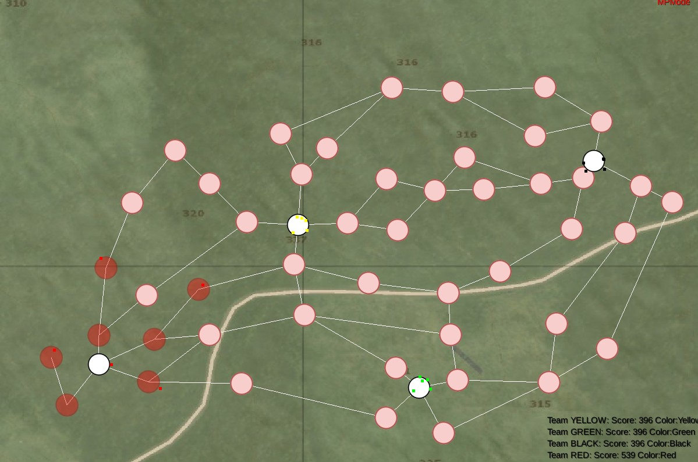

# Об игре
Tournex - игра мини-стратегия на основе графов.

Каждая команда имеет базу - белый круг, которым она владеет, а также 5 пешками (5 маленьких точек цвета команды). Задача игры - захватить как можно больше точек выбрав наилучшую стратегию для этого.

### Правила игры
1. Пешки захватывают точки. Захват происходит за фиксированное время.
2. Чем дальше от пешки находится точка тем дольше выполняется перемещение в эту точку.
3. При столкновении на точки двух пешек разных команд происходит соревнование дуэли где победитель определяется случайно, а проигравший автоматически покидает точку, возвращаясь на предыдущую.
4. Захват базы автоматически присваивает все точки команды захватывающей стороне. 
5. Во время игры ведется подсчет очков. Обычные точки приносят 1 очко в секунду, точки баз приносят 5 очков. 

Планируется:
6. Захват основной точки захватывает все дочерние точки относительно этой и точки базы. Тоесть если соединение паралельное и все точки принадлежат команде, то захват второй точки от базы захватывает все дочерние точки включая вторую. 

### Превью
 

### Этап разработки
На данный момент есть 2 режима игры - одиночный и мультиплеер. 

Сервер прилагается к проекту, однако на данный момент он настроен для локальной игры на одном компьютере, а не для глобальной.

Есть также возможности редактирования карты и последующего сохранения. Точки можно создавать, перемещать, соединять пути.

### Статус проекта
Проект находится в разработке. На данный момент он не пригоден для полноценной игры.